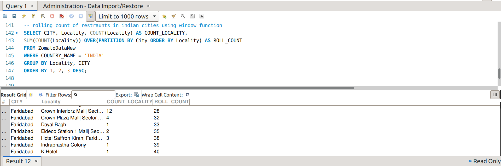
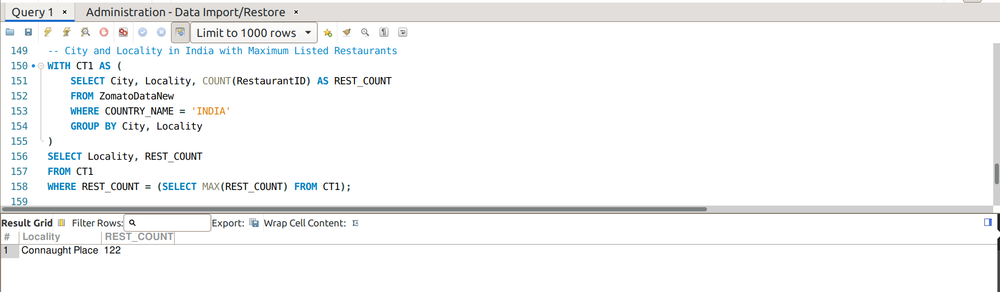

# Zomato Data Analysis Project

## Overview

This project involves a comprehensive analysis of restaurant data from Zomato, provided by Kaggle. The analysis leverages advanced SQL techniques to uncover insights about global restaurant distribution, online delivery trends, and rating patterns.

## Objectives

- **Analyze Restaurant Distribution:** Understand the spread of restaurants across different countries.
- **Online Delivery Trends:** Identify countries with the most restaurants offering online delivery.
- **Cuisine Popularity:** Discover popular cuisines in high-density restaurant areas in India.
- **Rating Insights:** Find the countries with the highest number of “Excellent” rated restaurants.
- **City-Specific Analysis:** Evaluate the number of “Excellent” restaurants across Indian cities.

## Key Insights

- **Global Distribution:** 90.67% of restaurants are listed in India, followed by 4.45% in the USA.
- **Indian Restaurants:** Connaught Place in New Delhi has the most restaurants, with North Indian cuisine being the most popular.
- **Table Booking Facility:** Only 54 out of 122 restaurants in Connaught Place offer table booking.
- **Ratings:** Restaurants with table booking have an average rating of 3.9/5, while those without have 3.7/5.
- **Best Moderately Priced Restaurant:** 'India Restaurant' in Kolkata, India, offers Indian cuisines, has an average cost for two < 1000, a rating > 4, and provides both table booking and online delivery.

## Tech Stack

- **Database:** MySQL
- **Data Source:** Kaggle
- **Query Language:** SQL
- **Data Analysis:** Advanced SQL Techniques

## Sample Queries and Outputs

### Query: Restraunt Count in Cities

### Query: Rolling Count of Restraunts in Indian Cities & Localities

### Query: City & Locality in India with Maximum Listed Restraunts

## Future Work

- Explore additional factors like customer reviews and price ranges.
- Analyze the impact of promotions and seasonal trends on restaurant success.
- Expand the dataset to include more recent or diverse sources of restaurant data.

## Contact

For any questions or further information, please contact me at inbox2mayank@gmail.com
